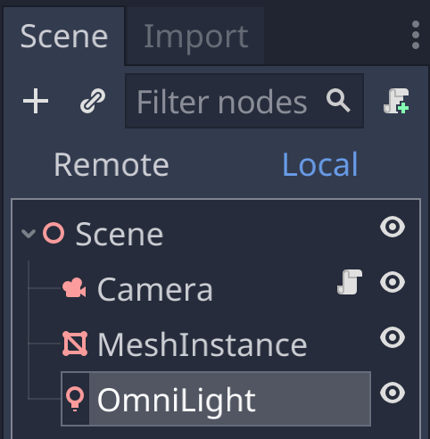

# Lighting the Cube

Now it's time to add [lighting](https://docs.godotengine.org/en/stable/tutorials/3d/lights_and_shadows.html).

## Add a Light

First, invoke Add Child Node again and search for a light.
The type of light we want is OmniLight, generally known as a point light,
i.e. a light that has a position and emanates light from that position in all directions
(unlike directional lights and spot lights which emit light in a certain direction).

Now our scene has a camera, cube, and light.

### Anatomy of a Light

In the Inspector, we can fiddle with the light's properties. For example, we can change the color to yellow so that the light emits yellow instead of white, and for the light to reach the cube's surface, we have to position the light outside the cube and, if necessary, adjust the range so make the sure the light extends to the cube.

And then when you hit Play, the cube should look yellow.

### Next Chapter

[Texturing the Cube](../chapter5/README.md)

