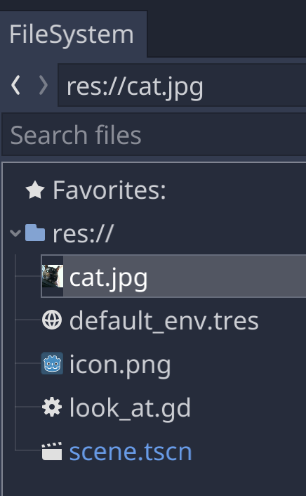
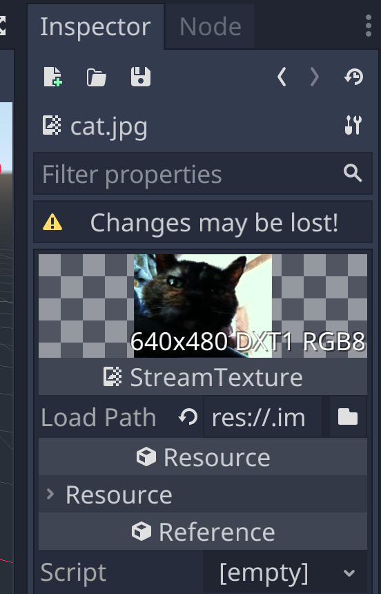
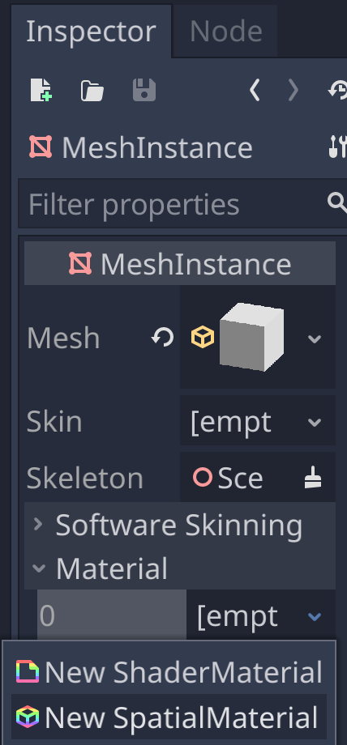
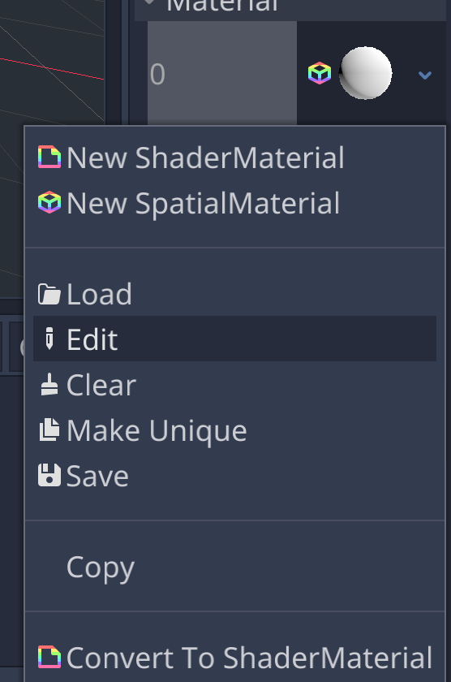
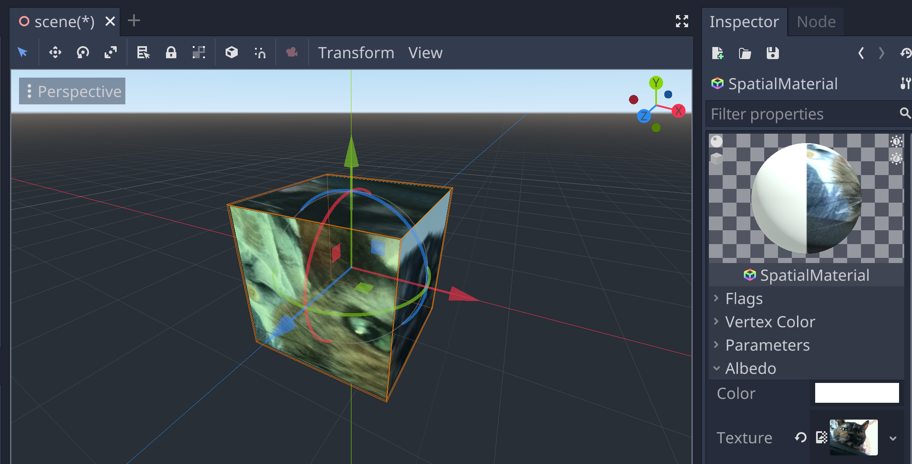
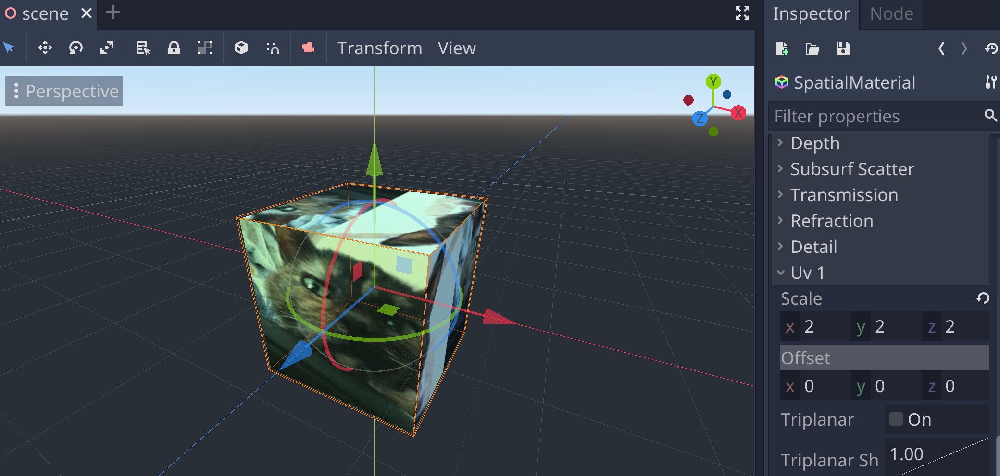
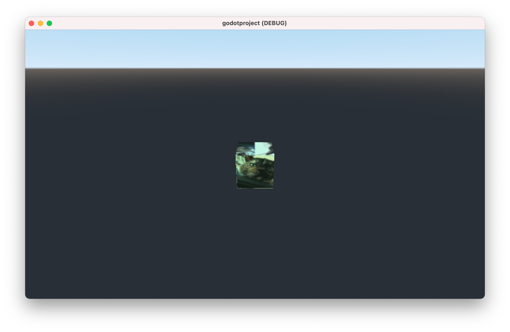

# Texturing the Cube

## Import a Texture

## Add a Material

To texture a the cube, we first need to assign a material to the MeshInstance.
Specifically, we need to click on the Empty material slot and select a [Spatial Material](https://docs.godotengine.org/en/stable/tutorials/3d/spatial_material.html).

And then Edit the new material.

## Assign the Texture

## Next Chapter

[Spinning the Cube](../chapter6/README.md)
