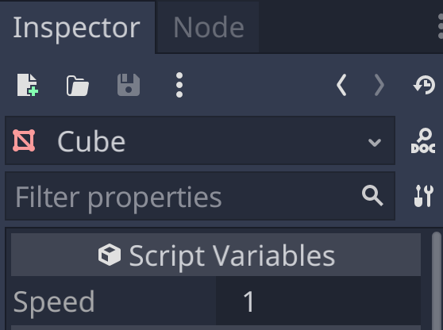
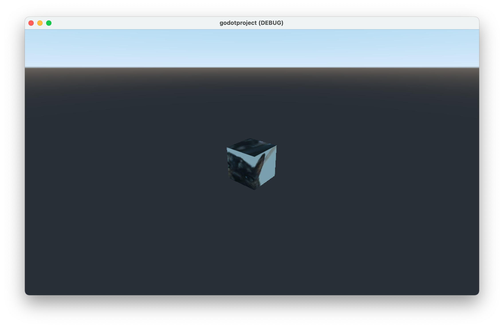
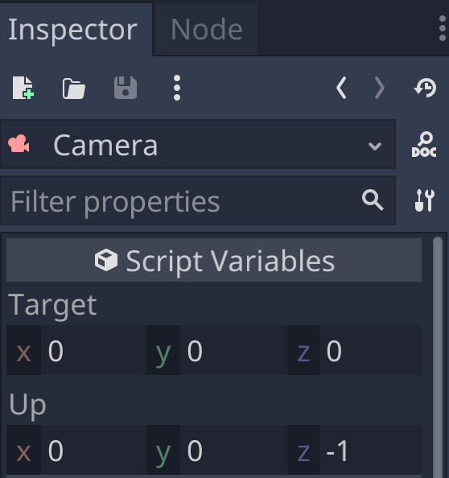

# Spinning the Cube

## Organize Assets

In this chapter, we'll add another script, so it's a good time to start organizing our assets into separate folder.

https://docs.godotengine.org/en/stable/getting_started/workflow/project_setup/project_organization.html#organization


## Script the Cube

In the previous chapter, we attached a new script to the Camera's parent [Node3D](https://docs.godotengine.org/en/latest/classes/class_node3d.html#class-node3d) and then placed a call to [Node3D.look_at](https://docs.godotengine.org/en/latest/classes/class_node3d.html#class-node3d-method-look-at).

Similarly, here we'll attach a new script to the Cube and add a call to [Node3D.rotate_y](https://docs.godotengine.org/en/latest/classes/class_node3d.html#class-node3d-method-rotate-y) to rotate the Cube around it's y-axis (or more precisely, the [Node3D](https://docs.godotengine.org/en/latest/classes/class_node3d.html#class-node3d) y-axis).

```gdscript
extends Node3D

export var speed = 1.0;

func _process(delta):
	rotate_y(delta*speed);
```

Since we [export](https://docs.godotengine.org/en/stable/getting_started/scripting/gdscript/gdscript_exports.html) the speed variable, it shows up in the Inspector as editable value, so we can change the speed, even while the scene is playing.



Hit the play button and we see the cube spin. Try changing the speed to different numbers.



## Rescript the Camera

Now that we know how to export variables in a script, let's update our Camera look_at script to be more reusable.

```gdscript
extends Node3D

export var target = Vector3(0,0,0)
export var up = Vector3(0,0,-1)

func _ready():
	look_at(target,up)
```

And now when we select the Camera node, the Inspector shows the new editable values.



## Next Chapter

[Reusing the Cube](../chapter07/README.md)
