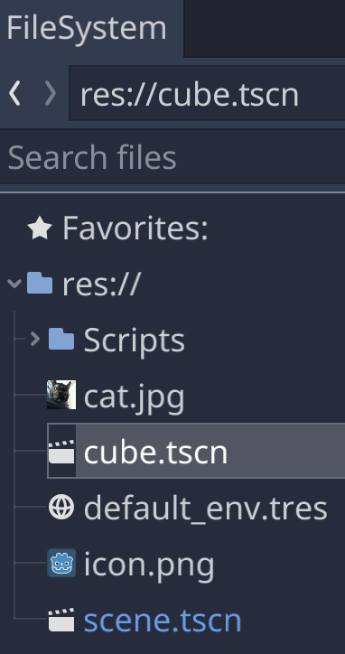
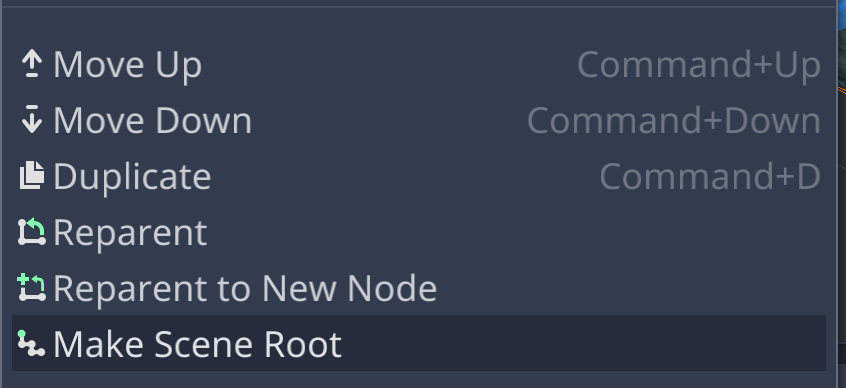
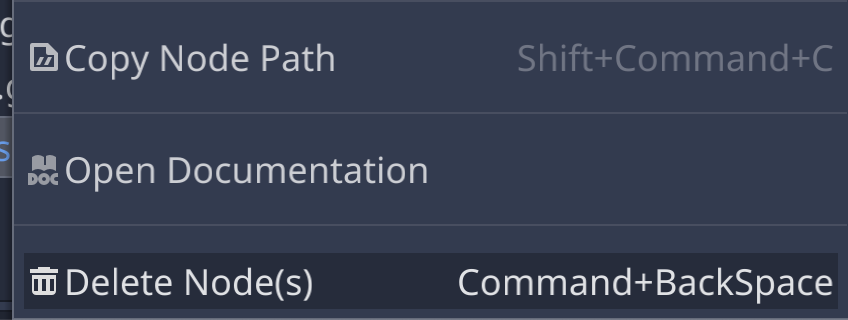
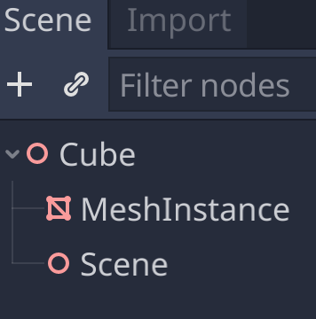
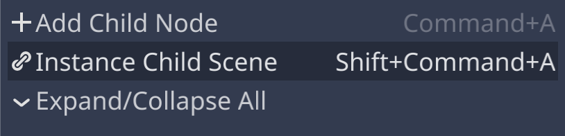
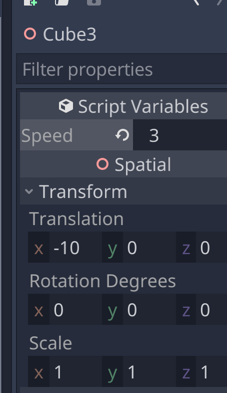
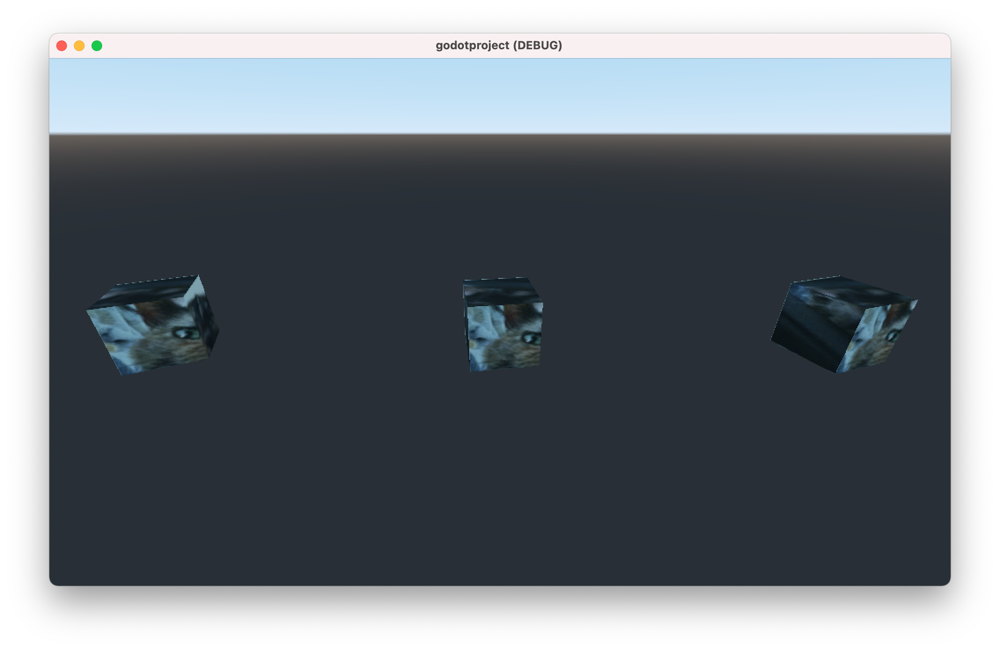

# Replicating the Cube

## Scenes within Scenes

### Copy the Scene

Save As to make a copy of the scene. Rename the new scene Cube.tscn.

In the new Cube scene, make the Cube node the scene root and delete all the other nodes.

### Instance the Scene

### Vary the Parameters

## Next Chapter

[Pausing the Game](../chapter08/README.md)

