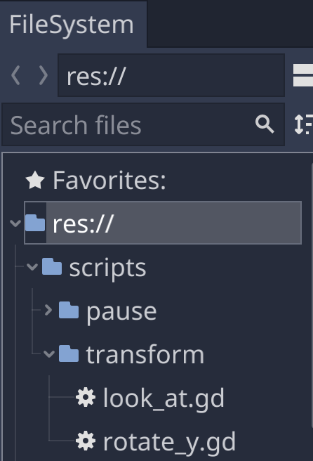
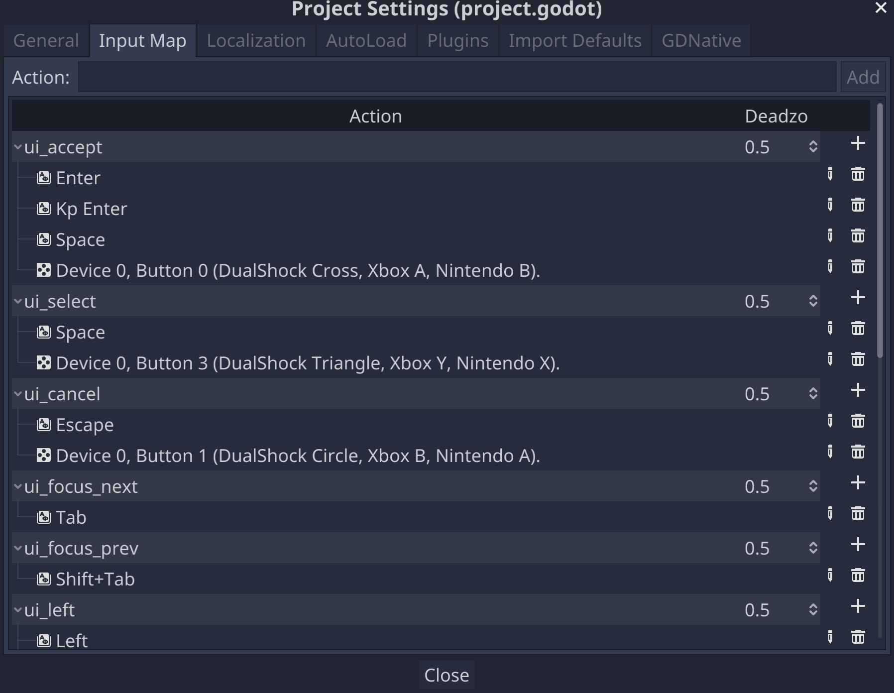
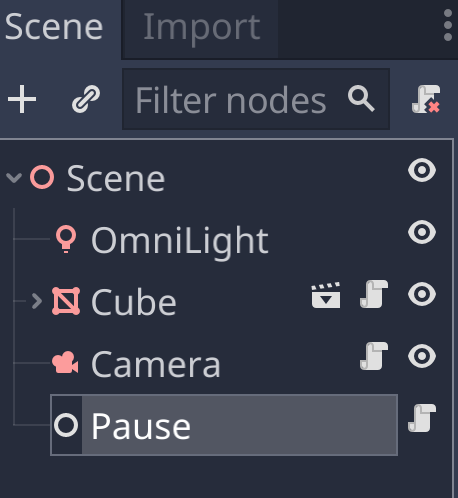
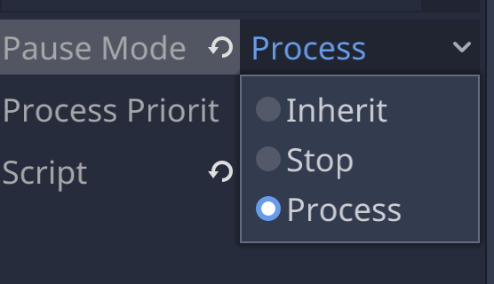

# Pausing the Game

## Getting Organized

We'll be adding a new script to pause and unpause the game, so let's reorg the scripts folder by adding a folder named *transform* for our existing scripts (since their functionality is to adjust node transforms) adn a folder named *pause* for any pause-related scripts.



## Input

### The Input Map

Instead of detecting, say, specific keyboard keys, we can use the generic names assigned in Godot's [input map](https://docs.godotengine.org/en/stable/tutorials/inputs/input_examples.html#inputmap) to the various device-specific input methods. To view, change, and add those settings, go the the Project menu, select Settings, and then the Input Map tab.



### Detecting Input

We can check for input by creating a script that implement the **_input** callback. Here we create a new script, name it pause.gd, attach it to the root scene node, and in the _input callback check if the action named *ui_cancel* in the input map is activated.

```gdscript
extends Node3D

func _input(event):
	if event.is_action_pressed("ui_cancel"):
		print("ui_cancelled!")
```

ui_cancel is assigned to the ESC key on desktop computers, so when you hit Play and then the ESC key, you'll see "ui_cancelled!" in the editor output pane.

### Pause

Now let's have the ESC key do something more interesting, namely pause the game (I know from experience that's the first thing people will complain about if you don't have it). We can take advantage of Godot's [pause game support](https://docs.godotengine.org/en/stable/tutorials/misc/pausing_games.html), and replace the print statement in our _input callback with a line that sets the game pause state to true.

```gdscript
func _input(event):
	if event.is_action_pressed("ui_cancel"):
		get_tree().paused = true
```

Now when you run the game and hit ESC, the game will pause. How about unpause? A succinct way to do that is set the pause state to the opposite, so ESC will pause/unpause the game.

```gdscript
func _input(event):
	if event.is_action_pressed("ui_cancel"):
		get_tree().paused = !get_tree().paused
```

Except this doesn't quite work, after pausing the game, all the scene nodes are have stopped running, including the node with the pause script.

To get around this, let's move the pause script to a new node.



The new node doesn't have to be [Node3D](https://docs.godotengine.org/en/latest/tutorials/3d/introduction_to_3d.html#node3d-node), since we're not doing any 3D with it, so just choosing basic Node is sufficient. A general good practice is to pick the most basic class you need. And that allows us to make our script a bit more general by extending Node instead of [Node3D](https://docs.godotengine.org/en/latest/tutorials/3d/introduction_to_3d.html#node3d-node), so we can attach it to any Node or subclass of Node.

```gdscript
extends Node

func _input(event):
	if event.is_action_pressed("ui_cancel"):
		get_tree().paused = !get_tree().paused
```

Now that the pause script is attached to a node that's separate and not above the nodes we want to pause, we can have it respond differently to a change in pause state. If set the pause mode for the Pause node to Process, then it will continue to run even if the game is paused.



Now when we hit Play and then hit the ESC key repeatedly, it will pause and unpause the game.

## Next Chapter

[Adding a GUI](../chapter09/README.md)

