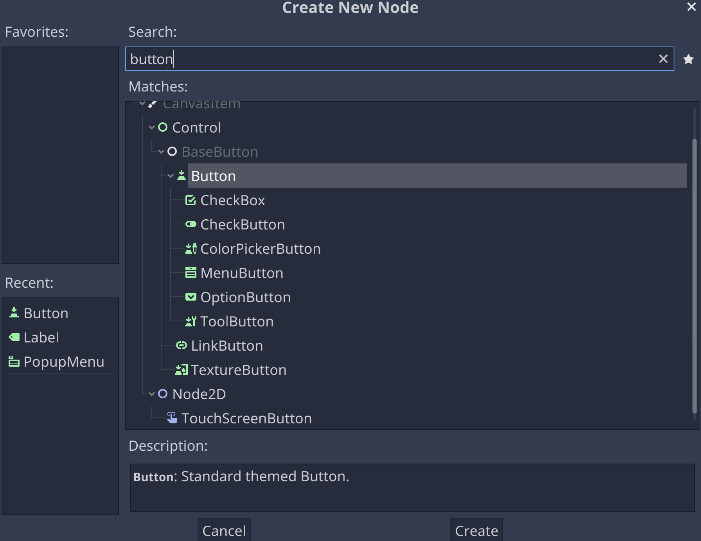
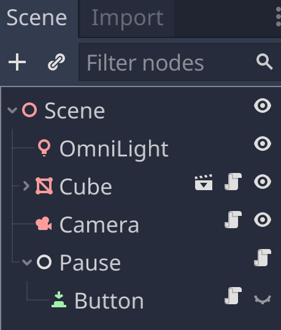
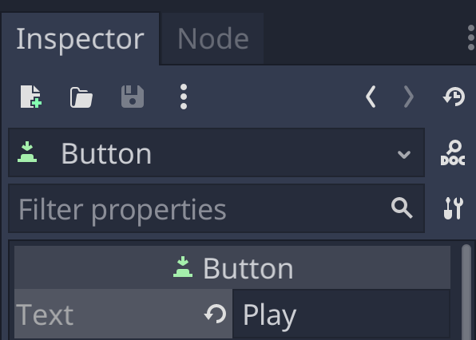
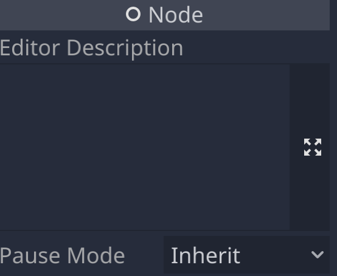
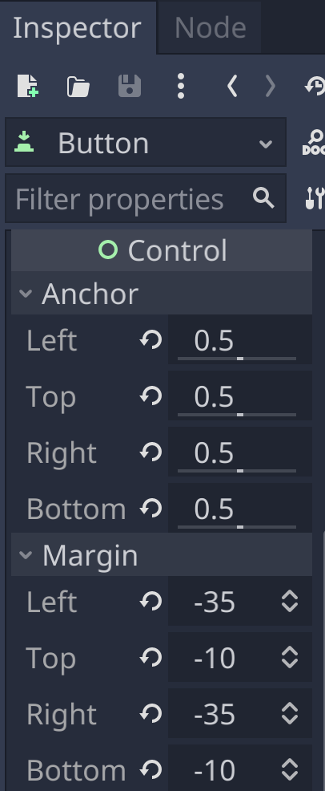

# Adding a GUI

## A Pause Button

I'm fine with just using the ESC key to pause and unpause a game, but conventionally there is a pause [GUI](https://docs.godotengine.org/en/stable/tutorials/ui/index.html),

### Adding a Button

Let's start with adding an Unpause [button](https://docs.godotengine.org/en/stable/classes/class_button.html#class-button) that appears when the game is paused. We'll add a Button as a child of the Pause node.





Set the Button text to "Play".




By default, it will inherit the pause mode of the parent Pause node, which is to always run whether or not the scene is paused.



Set the [size and anchors](https://docs.godotengine.org/en/stable/tutorials/ui/size_and_anchors.html) so that the Button is centered in the screen (no matter what resolution the screen is).



### Showing the Button

We add one more line to our pause script, using [get_node](https://docs.godotengine.org/en/stable/classes/class_node.html) to search for a child node named "Button" and making it visible if (and only if) the scene is paused.

```gdscript
extends Node

func _input(event):
	if event.is_action_pressed("ui_cancel"):
		get_tree().paused = !get_tree().paused
		get_node("Button").visible = get_tree().paused
```


### Scripting the Button

The Button doesn't do anything, yet, so we attach a new script to it, specifying that when it's pressed, the scene is unpaused, and the Button is set to invisible.

```gdscript
extends Button

func _pressed():
	get_tree().paused = false
	visible = false
```

## Next Chapter

[Adding a Menu](../chapter10/README.md)


