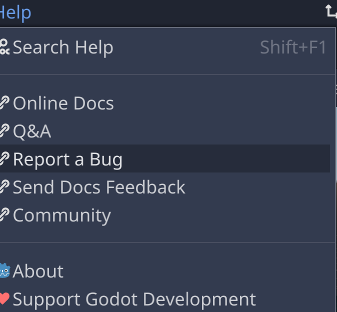

# Getting Started

## Prerequisites

### Install Godot

Builds for macOS, Windows, and Linux are available on the [Godot download page](https://godotengine.org/download),
which also has instructions for downloading view package managers such as HomeBrew and MacPorts.

## Get Help

>

### Read the Doc

https://docs.godotengine.org/en/stable/

### Ask Questions

https://godotengine.org/qa/

### Report Problems

The Help menu in the Godot editor has a bug report option that sends you to the Issues tracker for the
[Godot Github repo](https://github.com/godotengine/godot/issues).

### Report Documentation Problems

Documentation bugs are reported in the [documentation repo](https://github.com/godotengine/godot-docs/issues).

### Request Features

And yet another [Github repo](https://github.com/godotengine/godot-proposals) is used for project proposals.

### The Community

https://godotengine.org/community

