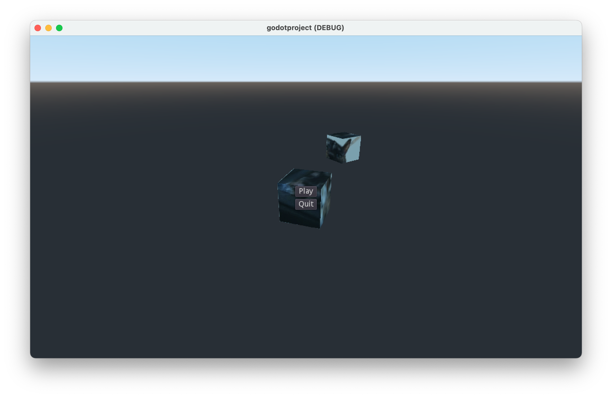

# Adding a Menu

## Adding a Container

Add a Container under the Pause node, name it Menu, and like we did with the pasue Button, set its initial Visibility to false.

### Updating the Pause Script

We want the ESC key to toggle the Container instead of the Button, so change the argument of get_node to Menu.

```gdscript
extends Node

func _input(event):
	if event.is_action_pressed("ui_cancel"):
		get_tree().paused = !get_tree().paused
		get_node("Menu").visible = get_tree().paused
```
## Adding the Button

Move the Button under the Menu so that it's a child node (drag or Reparent). Set its initial Visibility back to true.

### Updating the Pause Button

Now the actual visibility of the pause Button will be determined by the visibility of the parent Menu, so we change the un_pause script to hide it's parent instead of the Button itself.

```gdscript
extends Button

func _pressed():
	get_tree().paused = false
	get_parent().visible = false
```

## Adding a Quit Button

There's not much point in creating a container to hold just one Button, so let's add a Quit button. Create another child Button under the Menu, name it Quit, and ensure it follows the Play button, so that the Buttons appear in that sequence.


### Scripting the Quit Button

The Quit Button doesn't do anything, yet, so we attach a new script to it, specifying that when it's pressed, quit the game.

```gdscript
extends Button

func _pressed():
	get_tree().quit()
```



## Next Chapter

[Adding More Menu](../chapter11/README.md)
