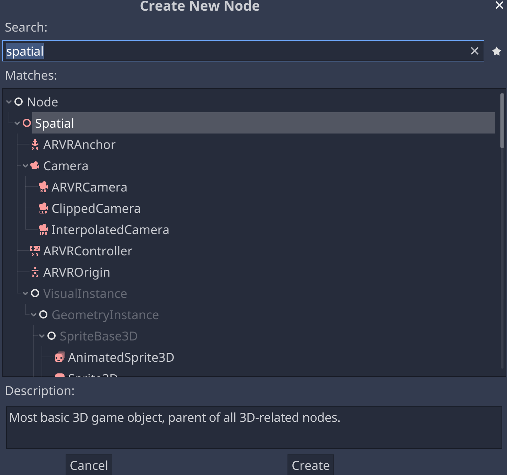

# Making a Scene

## Create a New Project

## Create a Spatial Node

### Anatomy of a Spatial Node

https://docs.godotengine.org/en/stable/tutorials/3d/using_transforms.html

## Add a Camera

### Anatomy of a Camera

### Create a Spatial Node

## Add a Cube to the Scene

### Make the Cube

### Frame the Cube

### Move the Cube

## Anatomy of a Cube

### Transform

### MeshFilter

### MeshRenderer

### BoxCollider

### Align with View

## Camera Control

### Import the Script

### Attach the Script

## Add a Light

https://docs.godotengine.org/en/stable/tutorials/3d/lights_and_shadows.html#

### Anatomy of a Light

### Type

### Range

### Color

### Intensity

### Shadow Type

### Cookie

### Culling Mask

### Flare

### Halo

### Render Mode

### Lightmapping

## Adjust the Light

### Make a Halo

## Add a Skybox

### Import the Skybox

### Anatomy of a Skybox

### Apply the Skybox

### Add a Flare

## Textures

https://docs.godotengine.org/en/stable/tutorials/3d/spatial_material.html

### Browse the Asset Library

https://docs.godotengine.org/en/stable/tutorials/assetlib/what_is_assetlib.html

## Explore Further

### Godo Docs

https://docs.godotengine.org/en/stable/index.html

### Godot Reference

### Computer Graphics

