# Making a Scene

https://docs.godotengine.org/en/stable/tutorials/3d/introduction_to_3d.html

## Create a Project

When you launch Godot, the first window presented is the Project Manager,
which lists known projects on the left and has a menu on the right for managing projects.

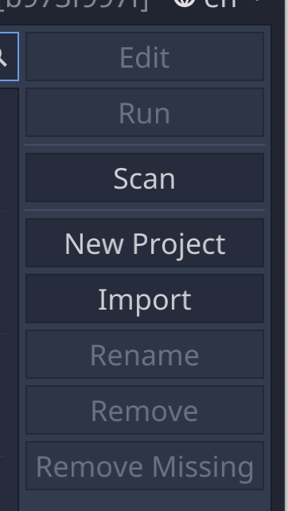

When you select New Project from the Godot launcher, you'll be prompted for the project location and then presented with the Godot editor, showing two files automatically created in the project directory: a default icon, and a default environment.

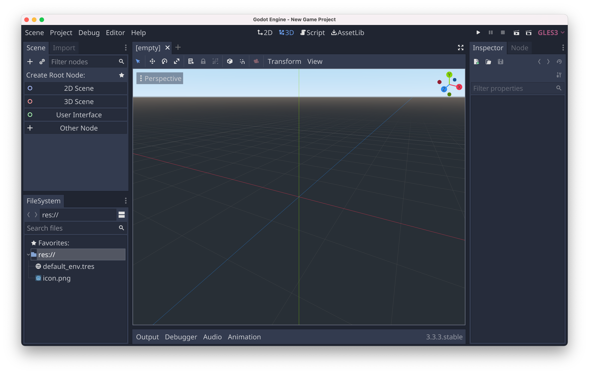


## Create a Scene

In just about all game engines, or at least 3D game engines, a game is composed of one or more levels or scenes (CryEngine and Unreal use the term level, Unity and Godo use scene). The term level is probably more recognizable to game players, but I think scene is a good analogy with movies. Maybe set is an even better analogy, as a scene is the arrangement of game assets (sometimes called props, to take the movie analogy further).

Godot is no exception -- a Godot project consists of one or more scenes, and each
scene is made up of a [hierarchy of nodes](https://docs.godotengine.org/en/stable/getting_started/step_by_step/scenes_and_nodes.html), each node representing a position/rotation/scale with respect to its parent node.

In computer graphics, such a hierarchy is called a scene graph, but more specifically it's a tree, i.e. there's a single starting root node and there are no circularities in the graph.

In Godot, the root node determines the type of scene, so the first thing that the editor asks you to do with an empty project is select the appropriate node/scene to start. When you select 3D Scene, the editor will create a [Spatial node](https://docs.godotengine.org/en/stable/tutorials/3d/introduction_to_3d.html#spatial-node) as the root node.

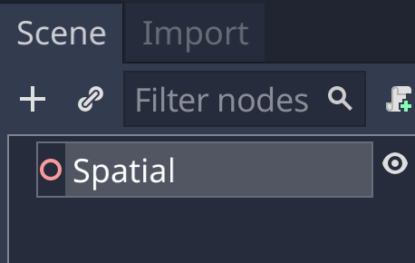

The key property of a Spatial node is its [transform](https://docs.godotengine.org/en/stable/tutorials/3d/using_transforms.html), which encapsulates the node's 3D position, rotation, and scale (relative to any parent transforms).


## Save the Scene

If you hit the Play button now, the editor will still say you first need to select a scene, so you need to save the scene.

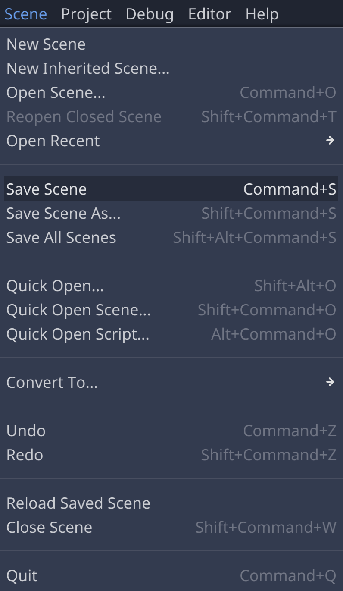

The [Godot style guide](https://docs.godotengine.org/en/stable/getting_started/workflow/project_setup/project_organization.html#style-guide) recommends snake_case for filenames. Here we just save it as "scene.tscn" (.tscn is the automatically supplied suffix for scene files). After saving, you should see the new file in the FileSystem view.

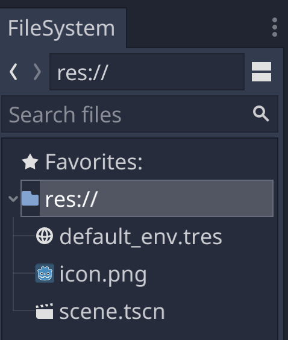

If you hit Play now, you can select the saved scene as the scene to play.

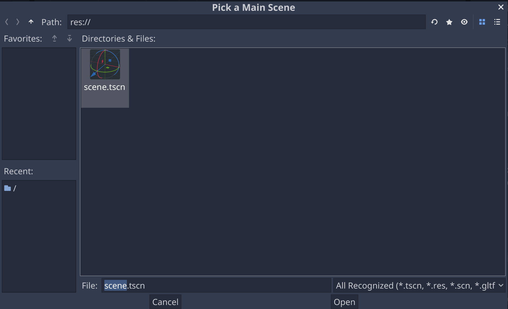

But the game window doesn't display anything,

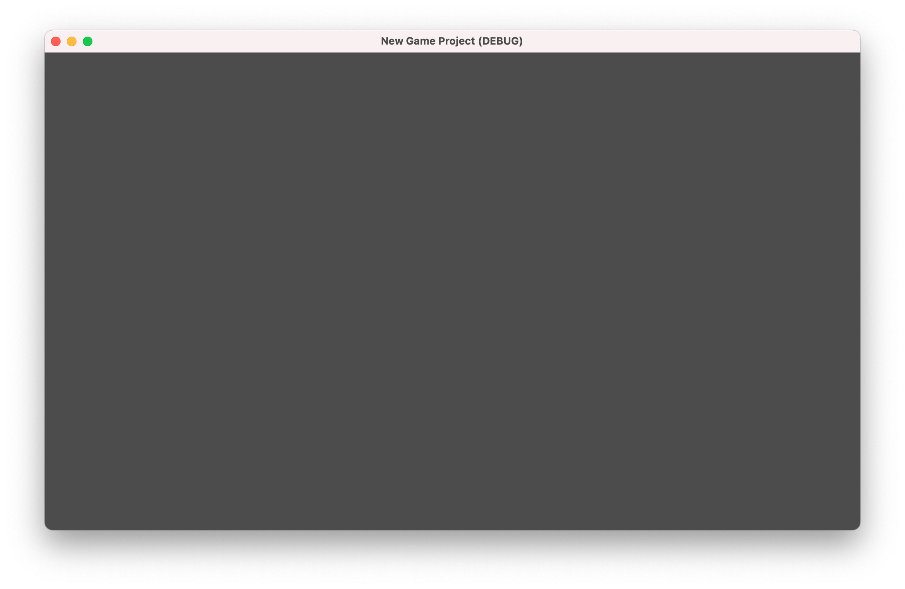

This is because the scene doesn't have a Camera.

## Create a Camera

In a 3D scene, the camera represents the view point, so it could also be considered the simulated eye (or eyes, if we're doing stereo as in virtual reality), but you can also think of it as a movie camera. A lot of terminology we use for CG cameras is similar, such as setting the field of view (FoV), or animating the camera with pan, zoom, dolly moves etc.

To add a Camera to the scene, right-click/control-click on the root node and select Add Child.

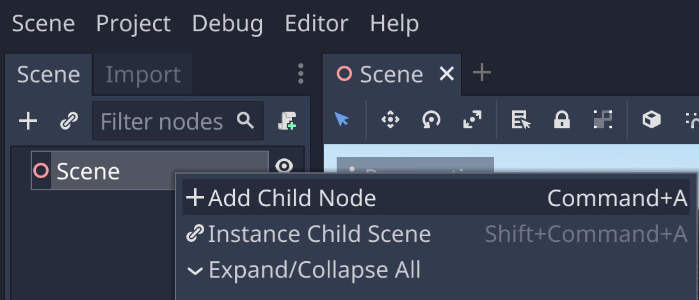

There are a lot of possible nodes to add, but you can find the Camera node quickly by typing Camera in the search field.


Now you should see a Camera node under the scene root node.

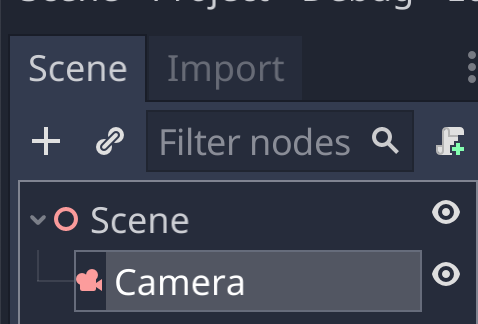

And when you hit Play, the default environment (blue skies!) is now rendere.

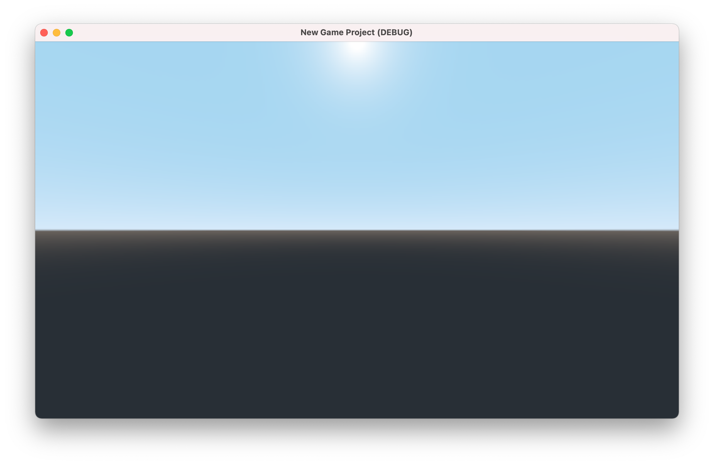

### Anatomy of a Camera

Select the Camera to see its properties in the Inspector

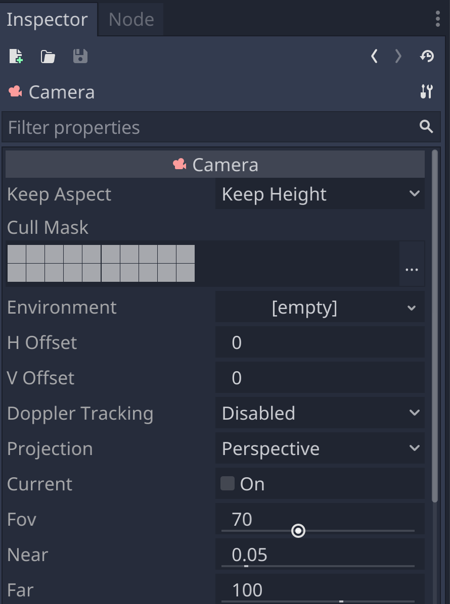

## Add a Cube to the Scene

### Make the Cube


### Frame the Cube

### Move the Cube

## Anatomy of a Cube

### Align with View

## Camera Control

### Attach the Script


- name the script look_at (snake_case, following the Godot naming conventions)
- replace the *pass* line in the *_ready* function

Leave two empty lines before the *_ready* function, following [the Godot coding style conventions](https://docs.godotengine.org/en/stable/getting_started/workflow/project_setup/project_organization.html#style-guide).

```gdscript
extends Spatial


func _ready():
	look_at(Vector3(0,0,0),Vector3(0,0,-1));
```

## Add a Light

https://docs.godotengine.org/en/stable/tutorials/3d/lights_and_shadows.html#


### Anatomy of a Light


### Lightmapping

## Adjust the Light

### Make a Halo

## Add a Skybox

### Import the Skybox

### Anatomy of a Skybox

### Apply the Skybox

### Add a Flare

## Textures

https://docs.godotengine.org/en/stable/tutorials/3d/spatial_material.html


### Browse the Asset Library

https://docs.godotengine.org/en/stable/tutorials/assetlib/what_is_assetlib.html


