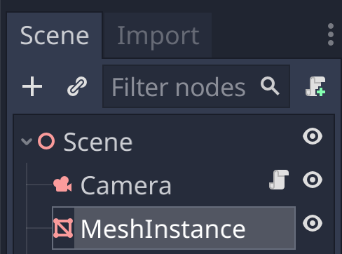
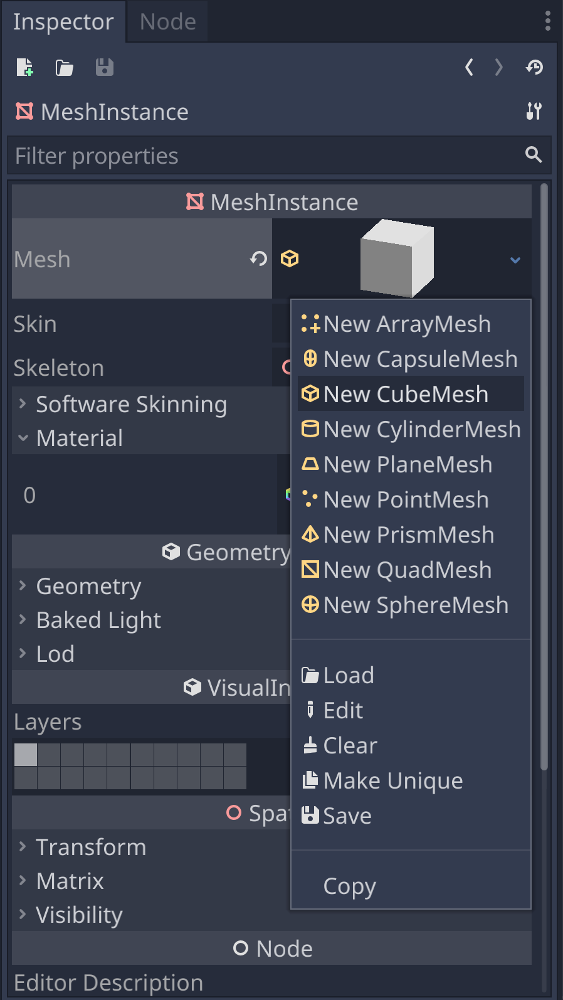
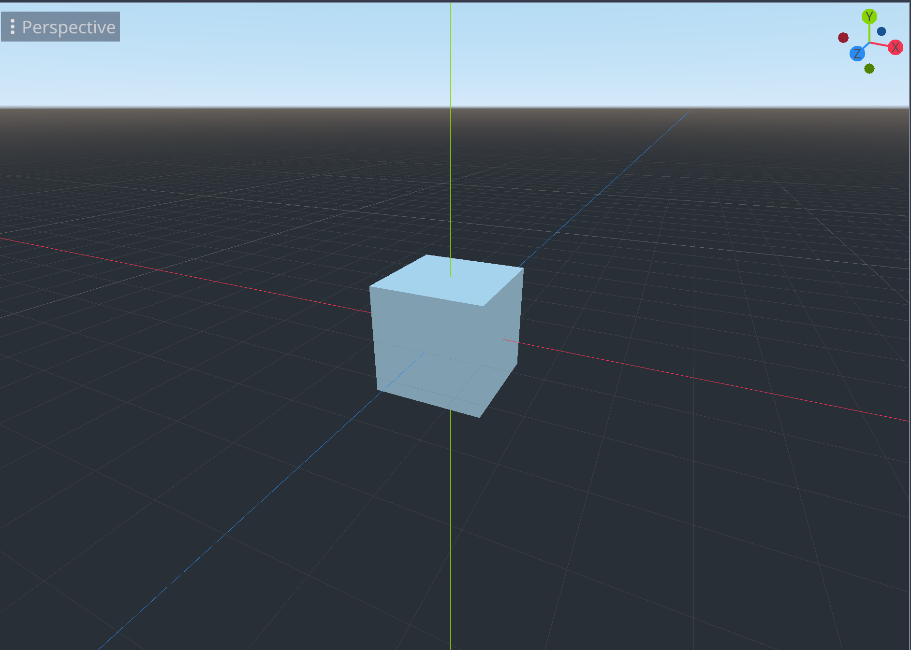
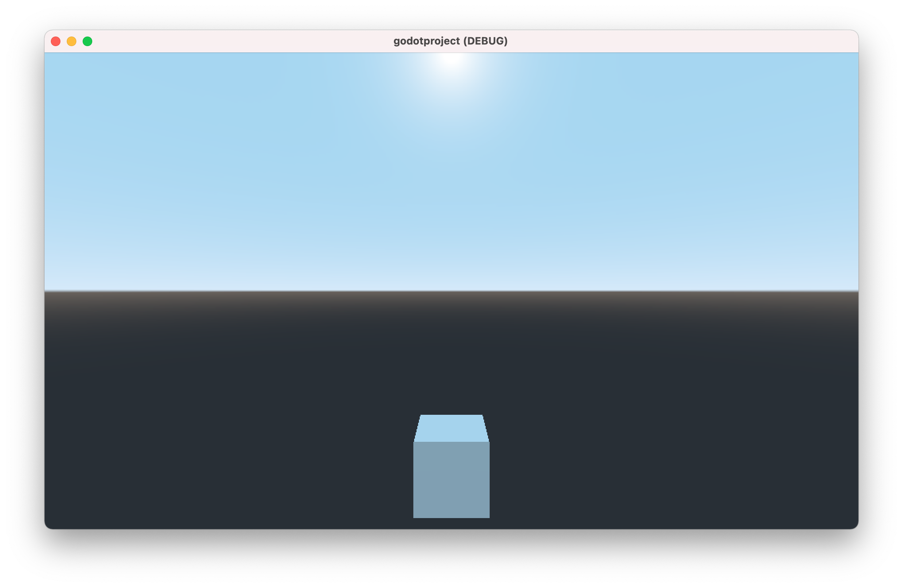

# Creating a Cube

In the previous chapter, we created a scene and added a Camera so we can actually see the scene. Now let's start populating the scene so we have something to look at.

## Make a Mesh

In the same manner as we added a Camera to the scene in the previous chapter, we can add a cube. Specifically, we'll add a MeshFilter.


You should now see the MeshInstance node under the scene root node.



We still have to assign a mesh to the MeshInstance. We'll use a CubeMesh.



In the 3D view, we now see a cube.



And also when we hit Play, if the Camera is looking in its general direction.



## Script the Camera

But really, we want the Camera to look directly at the cube. Let's take this opportunity to script the Camera.


- name the script look_at (snake_case, following the Godot naming conventions)
- replace the *pass* line in the *_ready* function

Leave two empty lines before the *_ready* function, following [the Godot coding style conventions](https://docs.godotengine.org/en/stable/getting_started/workflow/project_setup/project_organization.html#style-guide).

```gdscript
extends Spatial


func _ready():
	look_at(Vector3(0,0,0),Vector3(0,0,-1));
```

## Add a Light

https://docs.godotengine.org/en/stable/tutorials/3d/lights_and_shadows.html#


### Anatomy of a Light


## Textures

https://docs.godotengine.org/en/stable/tutorials/3d/spatial_material.html


### Browse the Asset Library

https://docs.godotengine.org/en/stable/tutorials/assetlib/what_is_assetlib.html


