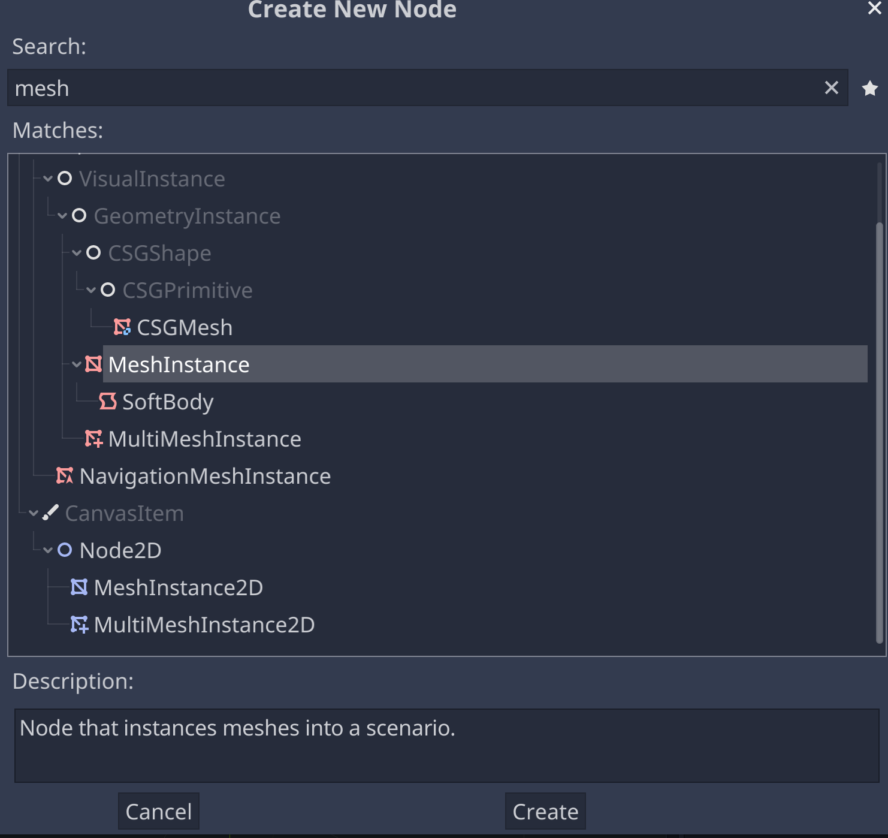
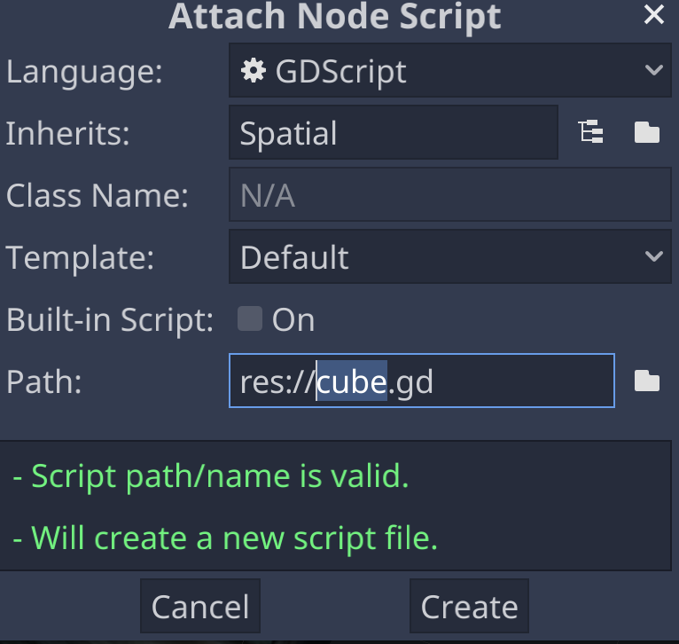

# Creating a Cube

## Add a Cube to the Scene

### Make the Cube



### Frame the Cube

### Move the Cube

## Anatomy of a Cube

### Align with View

## Camera Control

### Attach the Script



- name the script look_at (snake_case, following the Godot naming conventions)
- replace the *pass* line in the *_ready* function

Leave two empty lines before the *_ready* function, following [the Godot coding style conventions](https://docs.godotengine.org/en/stable/getting_started/workflow/project_setup/project_organization.html#style-guide).

```gdscript
extends Spatial


func _ready():
	look_at(Vector3(0,0,0),Vector3(0,0,-1));
```

## Add a Light

https://docs.godotengine.org/en/stable/tutorials/3d/lights_and_shadows.html#


### Anatomy of a Light


### Lightmapping

## Adjust the Light

### Make a Halo

## Add a Skybox

### Import the Skybox

### Anatomy of a Skybox

### Apply the Skybox

### Add a Flare

## Textures

https://docs.godotengine.org/en/stable/tutorials/3d/spatial_material.html


### Browse the Asset Library

https://docs.godotengine.org/en/stable/tutorials/assetlib/what_is_assetlib.html


