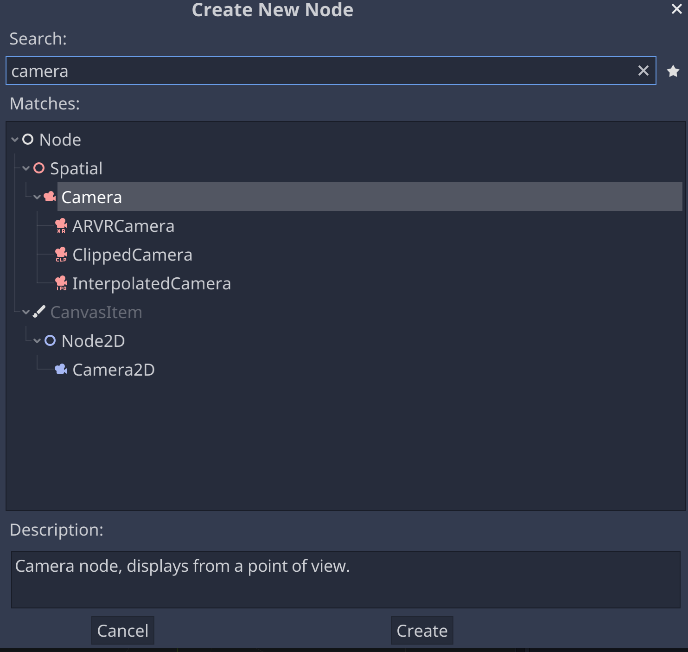
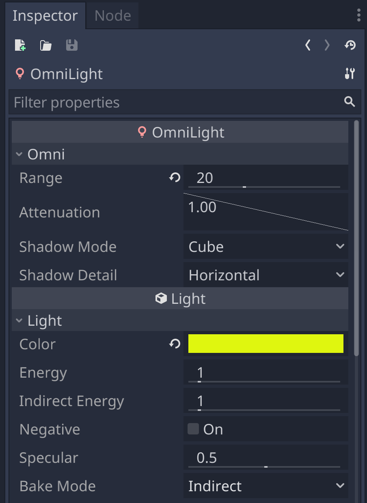
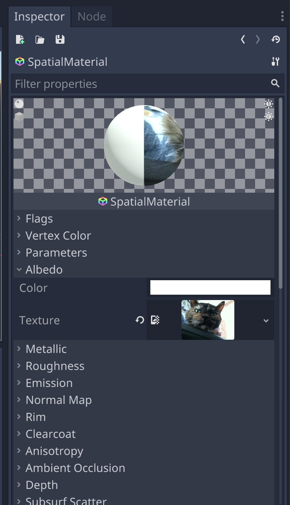

# Making a Scene

## Create a New Project

## The Main Camera

### Multiple Cameras

### Anatomy of a Camera

### The Transform

### Clear Flags

### Culling Mask

### Projection

### Viewport

### Depth

### Rendering Path

### Target Texture

### HDR

### Flare

### GUI

### Audio

## Add a Cube to the Scene

### Make the Cube

### Frame the Cube

### Move the Cube

## Anatomy of a Cube

### Transform

### MeshFilter

### MeshRenderer

### BoxCollider

### Align with View

## Camera Control

### Import the Script

### Attach the Script

## Add a Light

### Anatomy of a Light

### Type

### Range

### Color

### Intensity

### Shadow Type

### Cookie

### Culling Mask

### Flare

### Halo

### Render Mode

### Lightmapping

## Adjust the Light

### Make a Halo

## Add a Skybox

### Import the Skybox

### Anatomy of a Skybox

### Apply the Skybox

### Add a Flare

## Textures

### Browse the Asset Library

https://docs.godotengine.org/en/stable/tutorials/assetlib/what_is_assetlib.html

## Explore Further

### Godo Docs

https://docs.godotengine.org/en/stable/index.html

### Godot Reference

### Computer Graphics

