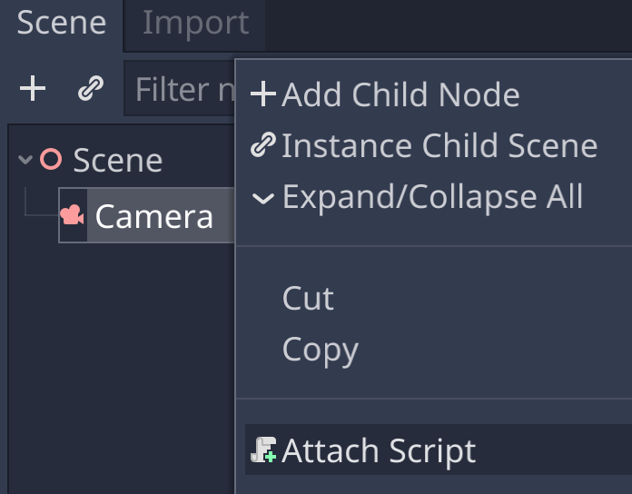
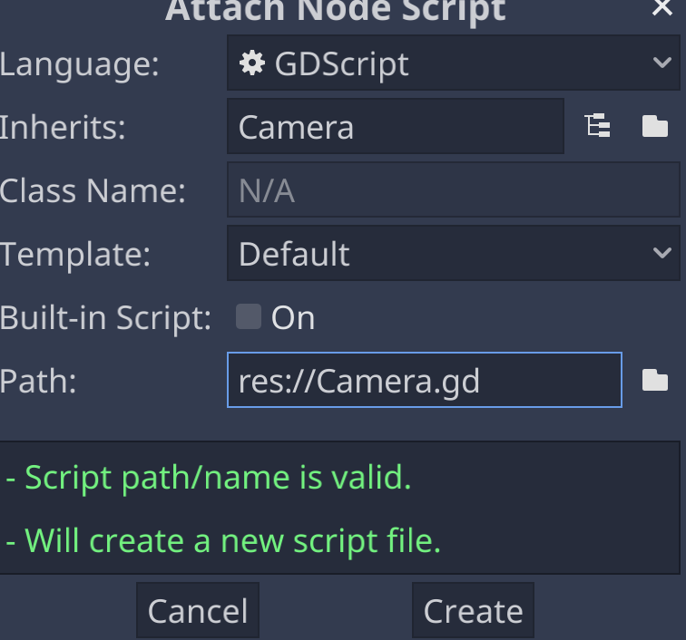
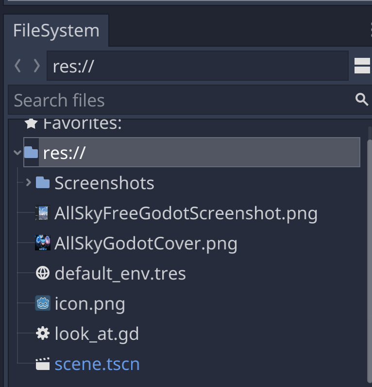
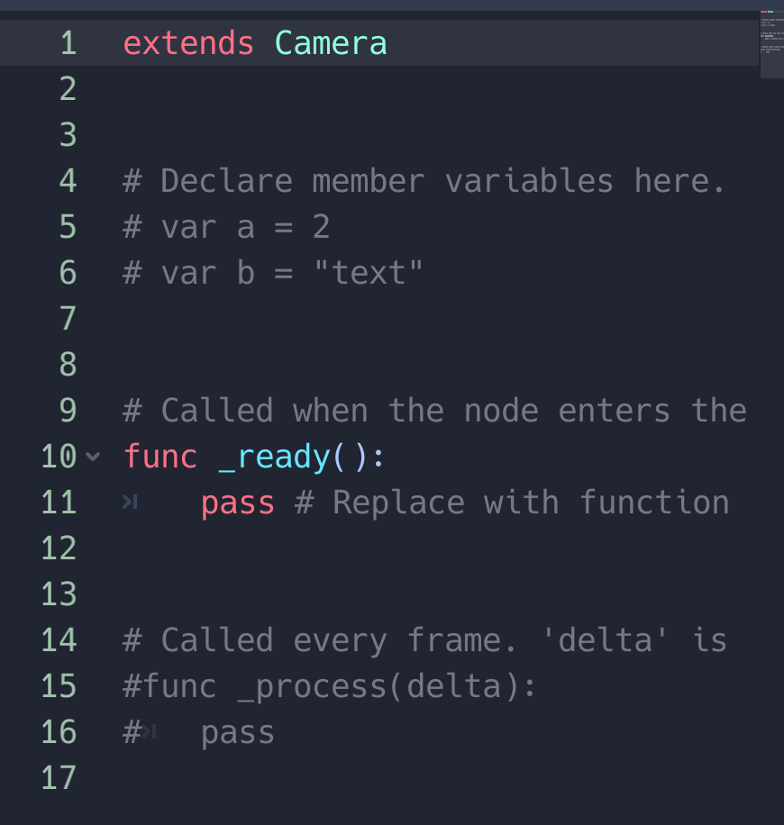
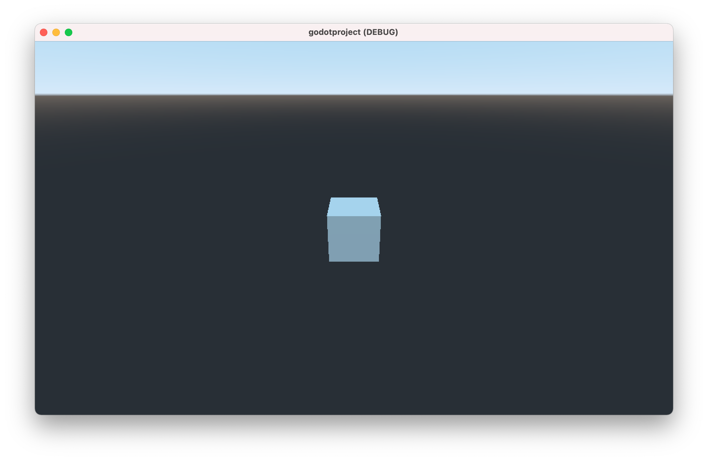

# Creating a Cube

In the previous chapter, we created a scene and added a [Camera](https://docs.godotengine.org/en/stable/classes/class_camera.html?highlight=camera#camera)
so we can actually see the scene.
Now let's start populating the scene so we have something to look at.

## Make a Mesh

In the same manner as we added a Camera to the scene in the previous chapter, we can add something to look at.
Normally, you'll [import assets](https://docs.godotengine.org/en/stable/getting_started/workflow/assets/index.html),
but we can create some simple geometry in the editor.

To start, we'll add a [MeshInstance](https://docs.godotengine.org/en/stable/classes/class_meshinstance.html).


You should now see the MeshInstance node under the scene root node.


We still have to assign a mesh to the MeshInstance. We'll use a CubeMesh.


In the 3D view, we now see a cube.


And also when we hit Play, if the Camera is looking in its general direction.


## Script the Camera

But really, we want the Camera to look directly at the cube. Let's take this opportunity to script the Camera.
Right-click/control-click on the Camera and select Attach Script.



The default name of the new script is the type of node we're attaching it to,
but we'll want to name this script look_at
(snake_case, following the Godot naming conventions).



You can always rename the script in the Filesystem view.



The new script is a template subclassing the node type and populated with stubs for two callbacks: one that runs when the node is first active,
and the other runs once per frame. You can edit the script within the Godot editor or using an external editor.



We're going to call the look_at function (defined in the Spatial node class) in the ready callback so that the camera points at the origin (coordinate 0,0,0),
and the second argument is an axis vector making sure the Camera is oriented vertically.

Since we're ony using a Spatial function we can keep this script general and more reusable by extending Spatial instead of Camera.
And we can leave out the process callback for now, no need to execute a function every frame that does nothing.

Leave two empty lines before the *_ready* function,
following [the Godot coding style conventions](https://docs.godotengine.org/en/stable/getting_started/workflow/project_setup/project_organization.html#style-guide).

```gdscript
extends Spatial


func _ready():
	look_at(Vector3(0,0,0),Vector3(0,0,-1));
```

Now when you hit Play, the Camera is now looking directly at the Cube.



## Next Chapter

[Lighting the Cube](../chapter4/README.md)

