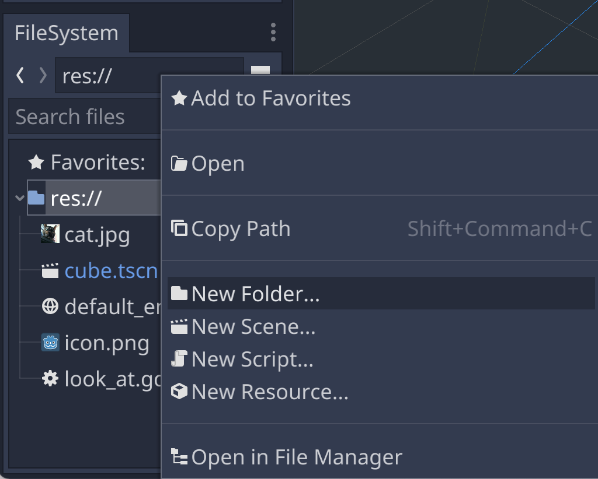
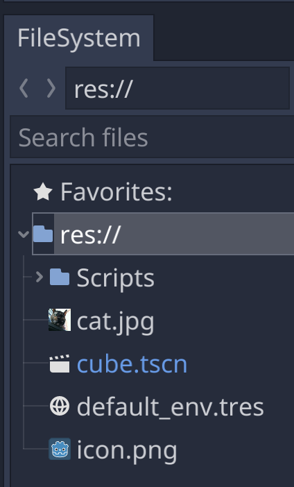
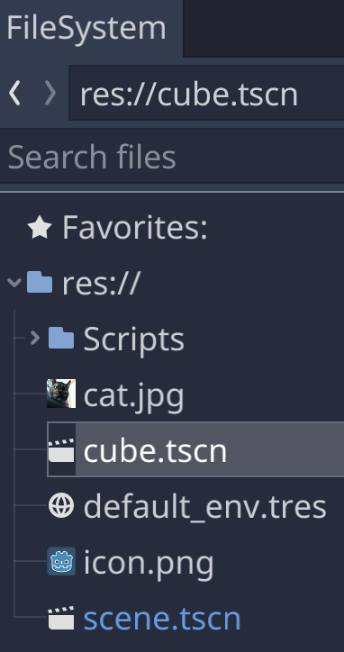
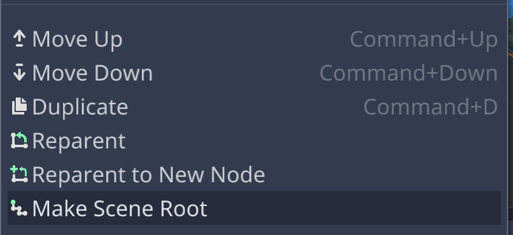
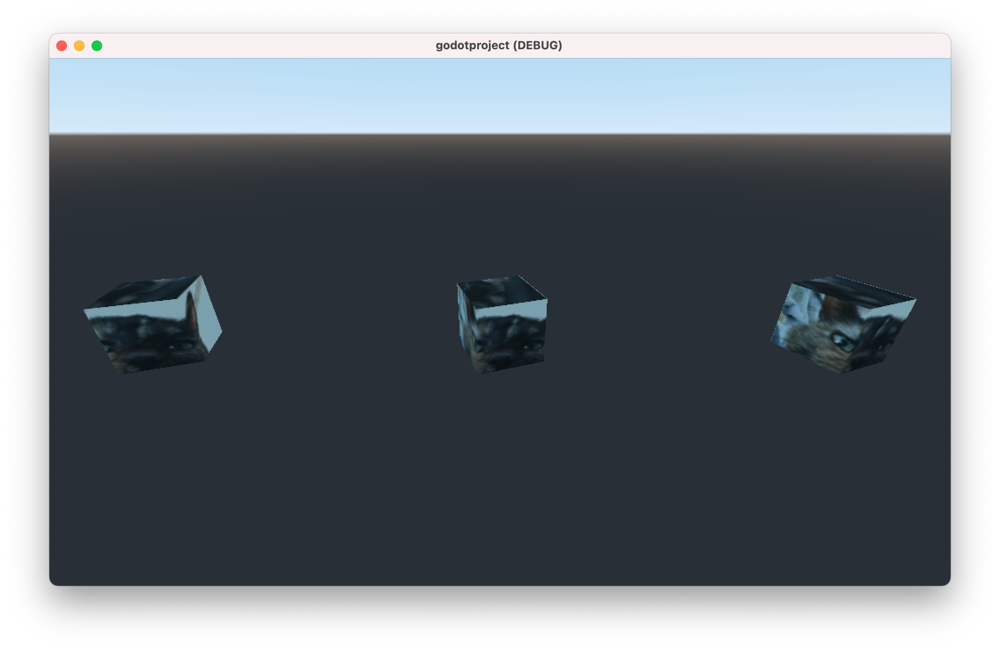

# Making It Move: Scripting the Cube

## Organize Assets

In this chapter, we'll add another script, so it's a good time to start organizing our assets into separate folder.

https://docs.godotengine.org/en/stable/getting_started/workflow/project_setup/project_organization.html#organization




## Script the Cube

In the previous chapter, we attached a new script to the Camera's parent [Spatial](https://docs.godotengine.org/en/stable/classes/class_spatial.html) node and then placed a call to Spatial.look_at.

Similarly, here we'll attach a new script to the Cube's parent Spatial node and add a call to Spatial.rotate_y to rotate the Cube around it's y-axis (or more precisely, the Spatial node's y-axis).

```gdscript
extends Spatial

export var speed = 1.0;

func _process(delta):
	rotate_y(delta*speed);
```

## Scenes within Scenes

### Copy the Scene

Save As to make a copy of the scene. Rename the new scene Cube.tscn.




In the new Cube scene, make the Cube node the scene root and delete all the other nodes.




### Instance the Scene




