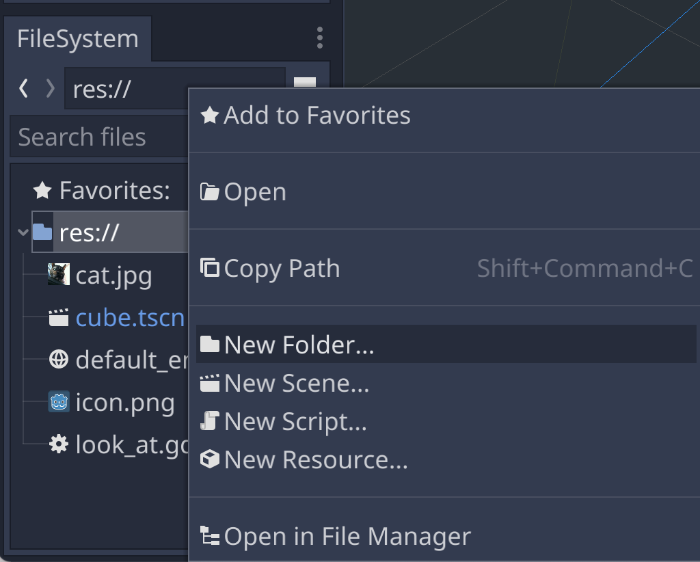
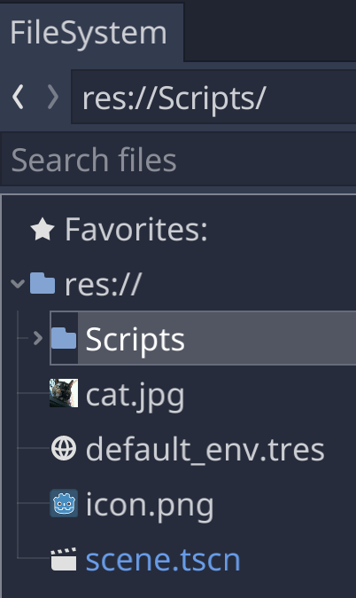
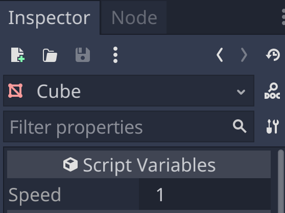
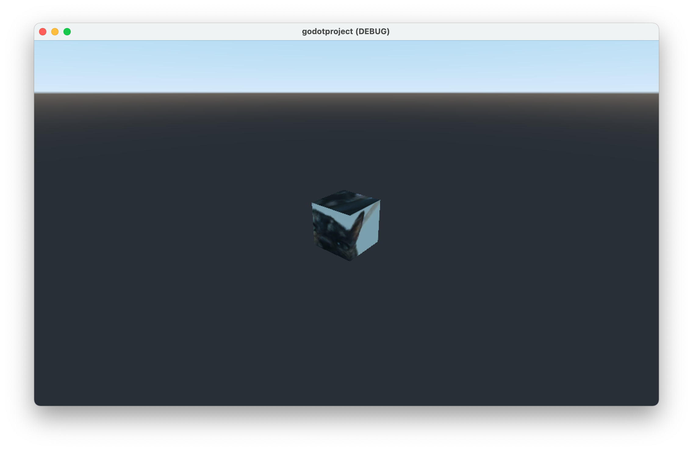

# Spinning the Cube

## Organize Assets

In this chapter, we'll add another script, so it's a good time to start organizing our assets into separate folder.

https://docs.godotengine.org/en/stable/getting_started/workflow/project_setup/project_organization.html#organization




## Script the Cube

In the previous chapter, we attached a new script to the Camera's parent [Spatial](https://docs.godotengine.org/en/stable/classes/class_spatial.html) node and then placed a call to Spatial.look_at.

Similarly, here we'll attach a new script to the Cube and add a call to Spatial.rotate_y to rotate the Cube around it's y-axis (or more precisely, the Spatial node's y-axis).

```gdscript
extends Spatial

export var speed = 1.0;

func _process(delta):
	rotate_y(delta*speed);
```

Since we [export](https://docs.godotengine.org/en/stable/getting_started/scripting/gdscript/gdscript_exports.html) the speed variable, it shows up in the Inspector as editable value, so we can change the speed, even while the scene is playing.



Hit the play button and we see the cube spin. Try changing the speed to different numbers.



## Next Chapter

[Reusing the Cube](../chapter7/README.md)
