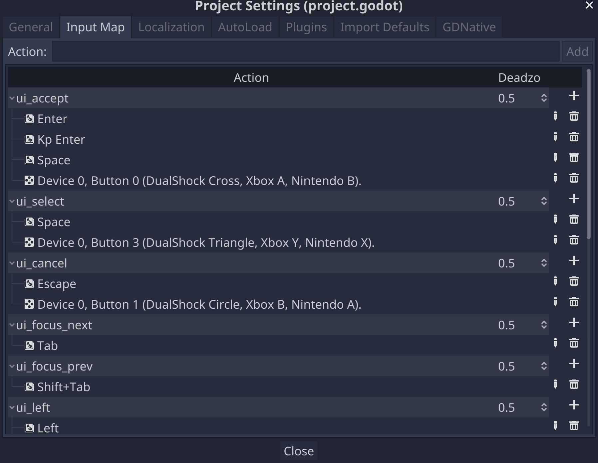

# Let's Play! Scripting the Game

## Input

### The Input Map

Instead of detecting, say, specific keyboard keys, we can use the generic names assigned in Godot's [input map](https://docs.godotengine.org/en/stable/tutorials/inputs/input_examples.html#inputmap) to the various device-specific input methods. To view, change, and add those settings, go the the Project menu, select Settings, and then the Input Map tab.



### Detecting Input

We can check for input by creating a script that implement the **_input** callback. Here we create a new script, name it pause.gd, attach it to the root scene node, and in the _input callback check if the action named *ui_cancel* in the input map is activated.

```gdscript
extends Spatial

func _input(event):
	if event.is_action_pressed("ui_cancel"):
		print("ui_cancelled!")
```

ui_cancel is assigned to the ESC key on desktop computers, so when you hit Play and then the ESC key, you'll see "ui_cancelled!" in the editor output pane.